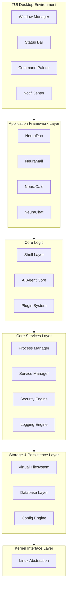

# NeuraOS

<div align="center">


<br/>

[](https://github.com/neura-spheres/NeuraOS/stargazers)
[](https://github.com/neura-spheres/NeuraOS/network/members)
[](LICENSE)
[](https://github.com/neura-spheres/NeuraOS/commits/main)
[](https://www.rust-lang.org/)
[](https://github.com/neura-spheres/NeuraOS)
[](https://github.com/neura-spheres/NeuraOS)

</div>

Hey guys, welcome to NeuraOS. This is a project I have been working on to build an AI native operating system right inside the terminal. It is basically a custom desktop environment built entirely in Rust that runs in your command line.

### What is this project?

Think of it like a mini OS that lives in your terminal. It has its own file system, its own shell, and a bunch of built in apps like a calculator, a calendar, a file manager, and a chat app. The coolest part is that it has AI baked right into it. You can hook it up to Gemini, OpenAI, or Ollama and just talk to it or have it help you out.

The main reason I made this is to build an OS that is AI agent native. I wanted something that can be fully controlled using AI from the ground up.

---

## Getting Started

> **tl;dr** — you need Rust ≥ 1.85. If you already have it, scroll to [Quick Start](#quick-start). If not, the setup scripts below will walk you through everything.

### Requirements

| Dependency | Minimum version | Why |
|---|---|---|
| [Rust](https://www.rust-lang.org/) | **1.85** (edition 2024) | The whole thing is written in Rust |
| [git](https://git-scm.com/) | any recent version | To clone the repo |
| C linker | — | `gcc`/`clang` on Linux·macOS, MSVC tools on Windows |

---

### Option A • Use the setup script (recommended)

We wrote setup scripts that check your environment, tell you exactly what's missing, and walk you through installing it. They use the same design language as NeuraOS itself.

**Linux / macOS:**
```bash
git clone https://github.com/neura-spheres/NeuraOS.git
cd NeuraOS
bash scripts/setup.sh
```

**Windows (PowerShell):**
```powershell
git clone https://github.com/neura-spheres/NeuraOS.git
cd NeuraOS
powershell -ExecutionPolicy Bypass -File scripts\setup.ps1
```

The script will:
- Check if Rust, git, and the C linker are installed
- If Rust is missing, print a step-by-step install guide with the exact commands to run
- If your Rust is too old, tell you how to update it
- Offer to build NeuraOS for you once everything checks out

---

### Option B • Manual setup

If you prefer doing things yourself, here's the full process.

#### Step 1 — Install Rust

Rust is installed through a tool called **rustup**. It manages your Rust version and keeps things up to date. Honestly, just use rustup. It's the official way and makes everything easier.

**Linux / macOS:**
```bash
curl --proto '=https' --tlsv1.2 -sSf https://sh.rustup.rs | sh
```
When it asks, hit Enter to go with the default install. Then reload your shell:
```bash
source "$HOME/.cargo/env"
```

**Windows:**

Download and run the installer from **https://win.rustup.rs/x86_64**, or with winget:
```powershell
winget install Rustlang.Rustup
```

> ⚠️ **Windows users:** Rust on Windows also needs the MSVC C++ build tools. During the rustup install it'll tell you if they're missing. You can grab them from [visualstudio.microsoft.com/visual-cpp-build-tools](https://visualstudio.microsoft.com/visual-cpp-build-tools/). Just select "Desktop development with C++" and you're good.

**Verify your install:**
```bash
rustc --version   # should print: rustc 1.85.x or newer
cargo --version   # should print: cargo 1.85.x or newer
```

More info: [doc.rust-lang.org/book/ch01-01-installation.html](https://doc.rust-lang.org/book/ch01-01-installation.html)

---

#### Step 2 — Clone the repo

```bash
git clone https://github.com/neura-spheres/NeuraOS.git
cd NeuraOS
```

---

#### Step 3 — Build it

```bash
cargo build --release
```

First build downloads and compiles all dependencies, it will takes a few minutes. Subsequent builds are way faster because of caching. You'll see a lot of output scrolling by, that's normal.

---

### Quick Start

If you already have Rust ≥ 1.85 and git installed, it's literally just this:

```bash
git clone https://github.com/neura-spheres/NeuraOS.git
cd NeuraOS
cargo run --release
```

---

### First boot

Once NeuraOS starts, you'll land in the shell. Here's what to do:

| Action | How |
|---|---|
| See all commands | type `help` |
| Open the app launcher | `Ctrl+P` |
| Open a specific app | `open <appname>` — e.g. `open chat` |
| Set up AI | open Settings → paste your API key |
| Exit | `Ctrl+C` or type `exit` |

**AI providers supported:**
- [Google Gemini](https://aistudio.google.com/app/apikey) (free tier available).
- [OpenAI](https://platform.openai.com/api-keys)
- [Ollama](https://ollama.com/) (fully local, no API key needed).

---

### Updating Rust if your version is too old

If you already have Rust but it's older than 1.85, just run:
```bash
rustup update stable
```

That's it. Rustup handles everything.

---

## How the code works

I split the code into a bunch of different crates so it is easier to manage. Here is the basic rundown of how everything fits together:

* **The Core Stuff:** Crates like `neura-kernel`, `neura-storage`, and `neura-process` handle the heavy lifting. They manage the virtual file system, save data using SQLite, and keep track of what is running.
* **The AI Brain:** The `neura-ai-core` crate is where the magic happens. It connects to different AI providers and handles the memory and agent logic so the AI actually understands what is going on.
* **The Apps:** The `neura-app-framework` sets the rules for how apps should work. Then, the `neura-apps` crate actually builds them out. This is where you will find the code for the notes app, the weather app, the file manager, and the terminal itself.
* **The UI:** The `neura-desktop` and `neura-shell` crates make everything look good. They handle the text based user interface, the themes, and parsing whatever commands you type in.

## Architecture

Here is a look at how the whole system is built. It is basically stacked in layers:



---

## Contributing

Feel free to poke around the code and see how it works. Check out [CONTRIBUTING.md](CONTRIBUTING.md) if you want to contribute. It is a pretty fun project and I hope you guys like it.

If you run into any issues getting it set up, open an [issue on GitHub](https://github.com/neura-spheres/NeuraOS/issues) and I'll help you out.

Drop a ⭐ on GitHub if you think it's cool!
